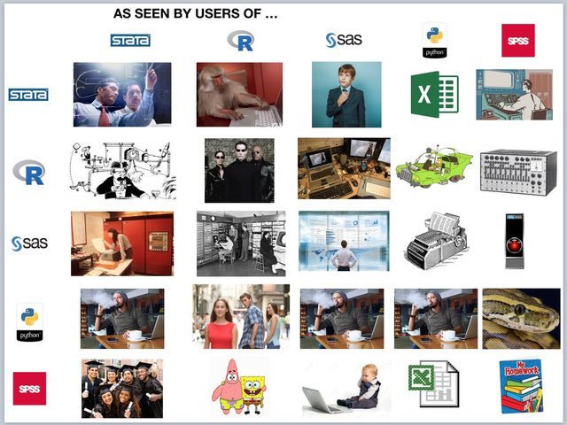
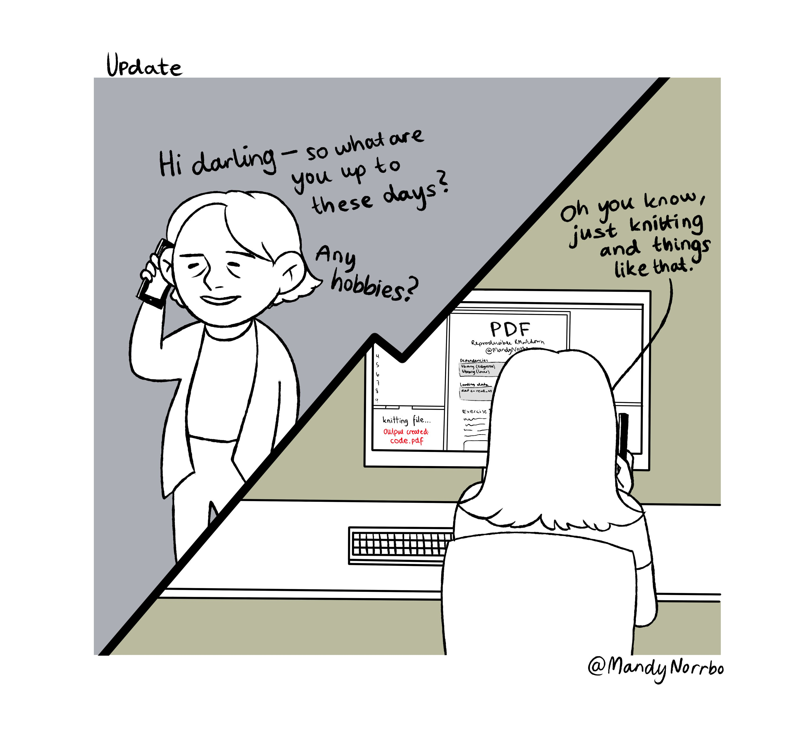
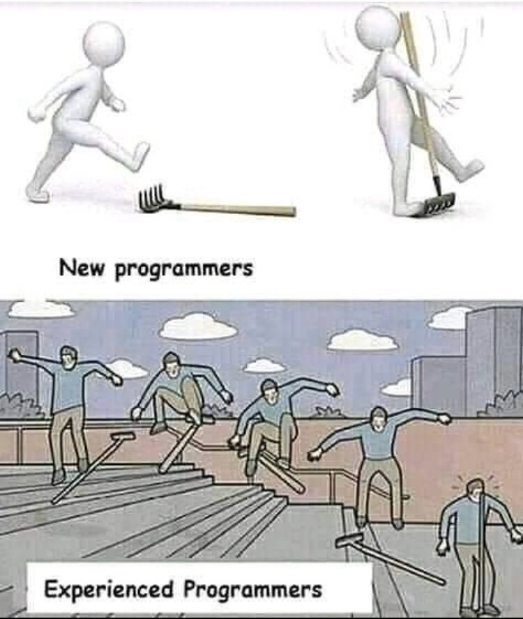

```{r setup, include=FALSE}
knitr::opts_chunk$set(echo = FALSE)

# A few notes about this document: 
#  You can alter the YAML header items (above the "---") as you see fit. 
  
#  If you want to change the theme and color, pick from the choices listed here:
#  http://deic.uab.es/~iblanes/beamer_gallery/
  
#  Also, more information on working with Rmd can be found here: 
#  https://www.rstudio.com/wp-content/uploads/2015/03/rmarkdown-reference.pdf

```

## Everyone has a preference...

```{r, out.width = "300px", fig.align="center"}

```

## What Makes R Different

R is a *statistical computing environment*. 

* free, open-source implementation (and extension) of the S language 
  - John Fox's R installation guide: [R-install-instructions.html](https://socialsciences.mcmaster.ca/jfox/Courses/R/ICPSR/R-install-instructions.html)
* makes routine data analysis easy and also supports convenient programming 
* user contributions have added markdown, LaTeX integration and powerful graphics 

## How To Use R

You can run R using the supplied GUI or run from a terminal 

* there are annoyances (crappy automatching, completion)
* R CMDR, particularly good as teaching tool for undergrads

Alternatives 

* text editors such as SublimeText, Atom, VScode
* IDE, most popular is [RStudio](https://rstudio.com/)
* plus of these is Git/version control

## Advantages of Using RStudio IDE

RStudio represents a collective effort; has shaped R use experience perhaps more than any other development.

* at least 20 active developers: [RStudio GitHub page](https://github.com/rstudio)
* key features include task-specific panes (i.e. workspace browser - very cool!)
* r markdown and git integration
* IDE can be used as an editor for R, markdown, LaTeX, plain text, etc.

## Pick up a new hobby: Knitting

```{r, out.height = "250px", fig.align="center"}

```

## Code Example

```{r summary, echo=TRUE}
data(iris)
summary(iris[, 1:3])
```

## Figure Example

```{r plot}
data(iris)
with(iris, plot(Sepal.Length, Sepal.Width))
```

## Tips and Tricks for UX

Creating a good user experience is key to productivity (even for occasional users).

* SOFT WRAP (not a sandwich, but almost as good)
* commenting with hotkey (and other hotkeys)
* IDE pane layout, theme
* user/machine-specific: how to create a `.rprofile` and what to avoid
* updating packages/upgrading to new R distribution

## Working with data

Base R is actually a really great data editing environment; RStudio has made this even better.

* data types
* variables
* loading; use `car::Import` for most types
* merging data (some words of caution)

## Programming in R

```{r, out.height = "200px", fig.align="center"}

```

## Functions

As a statistical computing environment, R allows for custom functions (and editing existing functions).

* why should you write your own function?
* general practices (i.e. masking)
* loops and conditionals
* apply, aggregate
* example: lag(x)

## Getting help

Since R is open-source and user contributed, there is no "help desk" as with Stata, others; don't despair, the R community can be very helpful. 

* help yourself: [documentation and manuals](https://www.r-project.org/help.html)
* a little light reading: textbooks, online books, guides
* anarchy in motion: [r stack on stack overflow](https://stackoverflow.com/questions/tagged/r)
* when in doubt, tweet: search for `#rstats`

